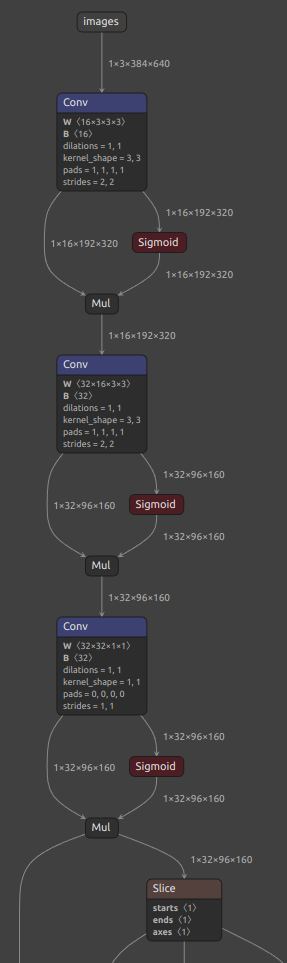
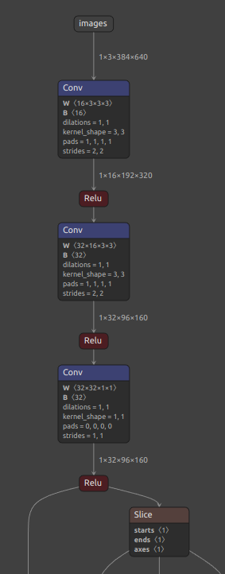
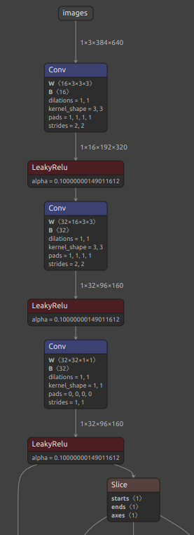

# SiLU_to_ReLU_ONNX
The python script to convert ONNX models SiLU activation layers in YOLOv5 or YOLOv8 to ReLU or LeakyReLU.

You need to install onnx in your python environment.

### Things to consider before running

The script find the SiLU activations (assuming if a layer connected to a sigmoid node and one another node, it is a SiLU)\
Then it destroys the SiLU(sigmoid and multiplication) layers, adding the declared activation function in the place.

! you need yo adjust the activation function you need using. (LeakyReLU and activations without any parameters were already implemented)

  
  ----->
   
  

